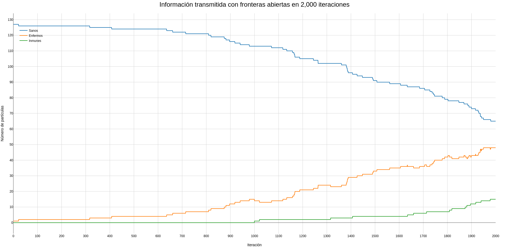
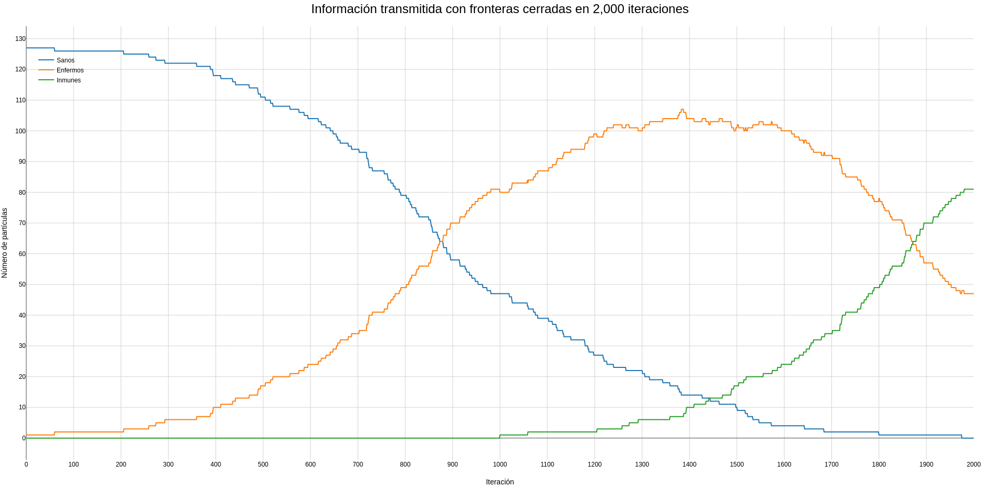
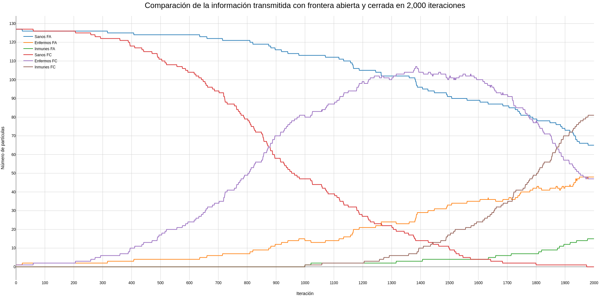

# Simulación de la transmisión de información
> **Nota**: este repositorio es un *fork* de [transmission](https://github.com/giccunam/transmission).

## Descripción
Este modelo simula como se transmite la información entre "partículas" bajo ciertas condiciones (con frontera abierta o frontera cerrada) en un tiempo determinado.

## Requisitos
- Compilador de C o C++  (gcc en nuestro caso)
- Python 3

## Instalación
1. Descarga el repositorio con el siguiente comando:
```
git clone https://github.com/ignacio-ireta/transmission.git
```

2.  Entra dentro de la carpeta **transmission** y crea un ambiente virtual de Python:
```
python3 -m venv venv
```

3.  Activa tu ambiente virtual e instala las librerías de Python:
```
pip install -r requirements.txt
```

## Uso
1. Entra a la carpeta **program** y compila los archivos de *C* con el siguiente comando:
```
 gcc -o main main.c montecarlo.c people.c population.c -lm
```

2. Ahora corre el siguiente comando redirigiendo la salida a un archivo ubicado en la carpeta **data**, sustituye  `x` por el nombre que desees ponerle a tu archivo:
```
./main >> ../data/x.dat
```

3. Por ultimo entra a la carpeta **visualization** y corre el comando, recuerda entrar al archivo y cambiar el nombre del archivo de los datos:
```
./plotter.py
```

## Transmisión de la información con la frontera abierta
En esta gráfica se muestra como se transmite la información entre 128 partículas con frontera abierta en un tiempo de recuperación de 1000 iteraciones y 2000 pasos de iteración.


## Transmisión de la información con la frontera cerrada
En esta gráfica se muestra como se transmite la información entre 128 partículas con frontera cerrada en un tiempo de recuperación de 1000 iteraciones y 2000 pasos de iteración.


## Comparación de las gráficas de transmisión de la información con la frontera abierta y cerrada
En esta gráfica se muestra la comparación de como se transmite la información entre 128 partículas con frontera abierta y cerrada en un tiempo de recuperación de 1000 iteraciones y 2000 pasos de iteración.


## Contribuidores
- José Ignacio Esparza Ireta
- Mario Alberto Martínez Oliveros
- Leonardo Ariel Tapia Figueroa

## Licencia
Este proyecto está bajo la licencia GPL-3.0. Consulta el archivo `LICENSE` para más detalles.